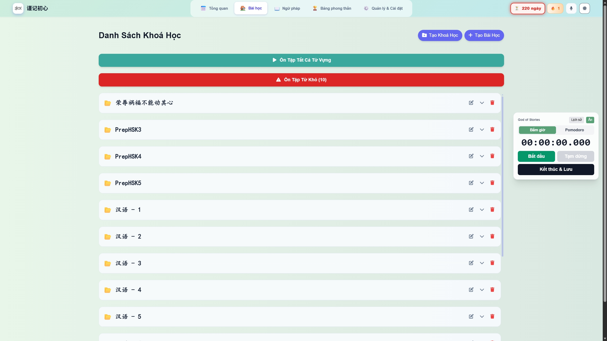
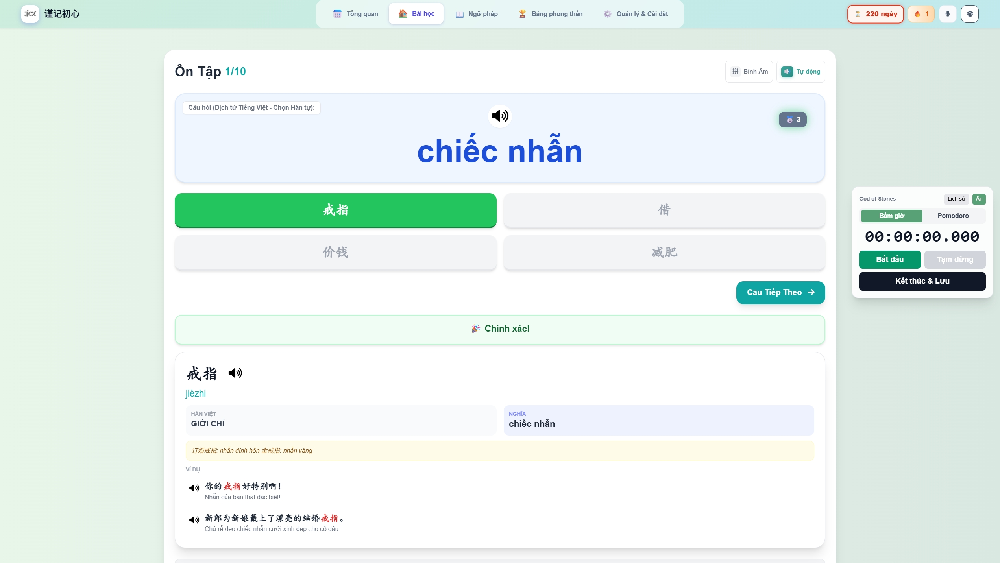
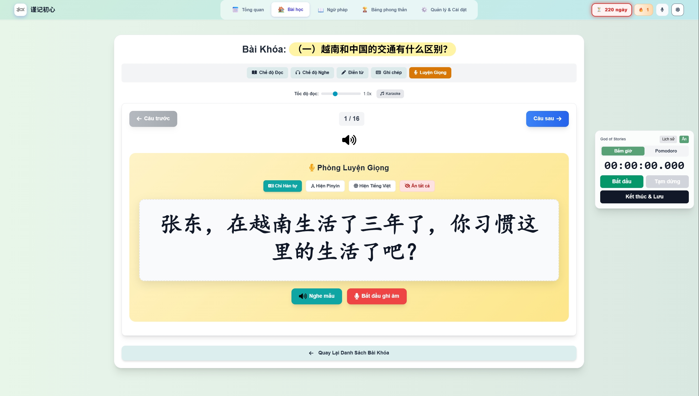

# RTG Chinese Learning

<p align="center">
  <strong>AI-assisted Chinese learning web app for Vietnamese learners</strong>
</p>

<p align="center">
  <em>Vocabulary · HSK Grammar · Pronunciation · Spaced Repetition · Study Tracking</em>
</p>

<p align="center">
  
  
  
  
</p>

---

## 🌟 Overview

**RTG Chinese Learning** is an all-in-one Chinese learning web app prototype designed for Vietnamese learners.

The project combines vocabulary learning, lesson management, HSK grammar practice, pronunciation/listening training, spaced repetition review, and study tracking into one browser-based product demo.

The current version is a **single-file static HTML prototype**. It was built this way for fast iteration, easy testing, and simple deployment through GitHub Pages or any static hosting platform.

---

## 🚀 Live Demo

- **Repository:**  
  `https://github.com/VinhOnGitHub/rtg-chinese-learning-demo`

- **Live Demo:**  
  `https://vinhongithub.github.io/rtg-chinese-learning-demo/`

> If the live demo is not available yet, GitHub Pages may still need to be enabled in repository settings.

---

## ✨ Key Features

### 📚 Course & Lesson Management

- Create and manage Chinese learning courses
- Organize lessons, vocabulary, passages, and practice content
- Designed for a local-first learning workflow

### 🀄 Vocabulary Learning

- Store Chinese characters, pinyin, Vietnamese meaning, and examples
- Support vocabulary import workflow
- Help learners review words repeatedly over time
- Suitable for building personal HSK vocabulary collections

### 🧠 HSK Grammar Practice

- HSK-oriented grammar learning flow
- Chinese examples with Vietnamese-friendly explanation
- Sentence structure and rearrangement practice
- Focus on helping Vietnamese learners understand Chinese grammar patterns

### 🔊 Pronunciation & Listening Practice

- Pronunciation and listening practice interface
- Chinese voice configuration support
- Designed for future AI-based pronunciation feedback
- Useful for combining reading, listening, and speaking practice

### 🔁 Spaced Repetition Review

- Review flow inspired by FSRS / spaced repetition
- Track correct and incorrect answers
- Help learners focus on weak vocabulary and grammar points
- Support long-term memory building

### 📊 Study Tracking

- Daily study goal
- Study streak
- Review progress
- Learning statistics
- Pomodoro / study timer style workflow

---

## 🤖 AI / Agent Usage

AI tools are used to support both development and learning content creation.

Current and planned AI-assisted workflows include:

- Generating Chinese example sentences
- Checking pinyin and Vietnamese translations
- Explaining HSK grammar points
- Creating review questions and practice materials
- Producing personalized mistake-based exercises
- Debugging and improving frontend code
- Refactoring the current prototype into a cleaner product structure
- Planning future Xiaomi MiMo API integration

The long-term goal is to integrate AI directly into the app so learners can receive personalized exercises, explanations, dialogue practice, and review plans based on their own mistakes.

---

## 🧩 Tech Stack

| Area | Technology |
|---|---|
| Frontend | HTML, CSS, JavaScript |
| UI | React-style single-page app structure |
| Styling | Tailwind CSS |
| Storage | localStorage / IndexedDB-style local-first storage |
| Speech | Chinese speech / voice configuration workflow |
| Learning Logic | Spaced repetition / FSRS-inspired review |
| Deployment | GitHub Pages / static hosting |

---

## 📸 Screenshots

> Screenshots can be added inside the `screenshots/` folder.

### Dashboard



### Vocabulary Management



### HSK Grammar Practice


### Pronunciation Practice



---

## 🛠️ How to Run Locally

This project is a static web prototype, so no installation is required.

Clone the repository:

```bash
git clone https://github.com/VinhOnGitHub/rtg-chinese-learning-demo.git
cd rtg-chinese-learning-demo
```

Open the app directly:

index.html

Or run a simple local server:

python -m http.server 8000

Then visit:

http://localhost:8000
📦 Project Structure
rtg-chinese-learning-demo/
├── index.html
├── README.md
└── screenshots/
    ├── dashboard.png
    ├── vocabulary.png
    ├── grammar.png
    └── pronunciation.png
🧪 Current Status

This project is currently an active prototype.

The app is already demonstrable as a browser-based product demo. The current code is still kept in a single HTML file for fast testing and iteration. Future versions will split the app into modular components and improve the data structure.

🗺️ Roadmap
 Enable and verify GitHub Pages live demo
 Add real product screenshots
 Split the single HTML file into modular components
 Improve vocabulary and lesson data structure
 Add cloud sync or account system
 Add AI-generated personalized exercises
 Add AI dialogue practice
 Add pronunciation scoring and feedback
 Integrate Xiaomi MiMo API for Chinese learning assistance
 Improve mobile UI and learning flow
 Build a reusable HSK content library

📌 Notes

This repository is a prototype and does not include private API keys or production credentials.

Some features are experimental and may depend on browser support, local storage, or external API configuration.

👤 Author

Built by VinhOnGitHub as an independent learning tool project for Vietnamese learners studying Chinese.
